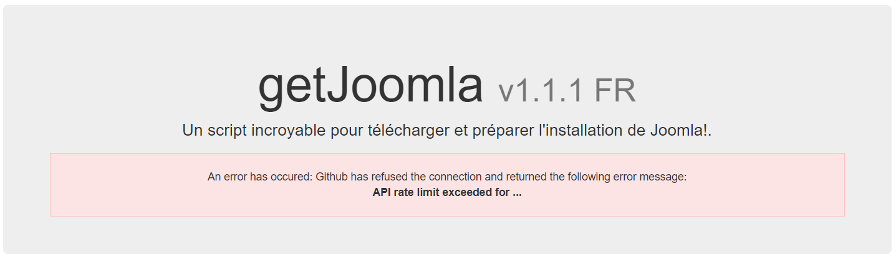

# GetJoomla

Compatible up to 

[English version](#english-version) - [Version francophone](#version-francophone)

## English version

Fork of the getjoomla script of BestProject [https://github.com/bestproject/getjoomla.php](https://github.com/bestproject/getjoomla.php).

This newer version contains:

* A fully refactored code,
* Require PHP 7.x or greater,
* More error messages to make debugging easier,
* When the `joomla.zip` file already exists in the root folder, no zip will be downloaded again (principle of caching)
* ...

This GetJoomla script has been written by BestProject [https://github.com/bestproject/getjoomla.php](https://github.com/bestproject/getjoomla.php) and translated in French by [Yann Gomiero](https://github.com/YGomiero) and refactored by [Christophe Avonture](https://github.com/cavo789)

### How to use

Just download a copy of the `src/index.php` file and save that file in the folder where you wish install Joomla. This done, start a browser tab and navigate to your folder; add `index.php` to the URL is needed.

You'll get this screen:

You'll be able to install the latest version of Joomla or an older one; just select the desired version from the list.

Once you've select a version, the script will download the package from the repository of the [French AFUJ](https://github.com/AFUJ/joomla-cms-fr/).

Depending on the speed of your internet connection, you just need to wait a few seconds before to see the well-known Joomla installation screen:

### FAQs

#### Github API rate limite exceeded

Some websites are hosted on a shared web hosting (like `OVH` in France). Every sites on that server will have the same IP address. 

Github will not be able to differentiate your site from the many sites on the same server; all will have the same IP address.

And, bad luck, your address could be considered as too important a consumer for Github, for his free version.

If you see the message below, you didn't have chance ... at that time; try again later.

## Version francophone

Fork du script getjoomla de BestProject [https://github.com/bestproject/getjoomla.php](https://github.com/bestproject/getjoomla.php).

Cette nouvelle version contient :

* Un code entièrement remanié,
* Requiert PHP 7.x ou plus,
* Bien plus de messages d'erreur pour faciliter le débogage,
* Lorsque le fichier `joomla.zip` existe déjà dans le dossier racine, aucun zip ne sera téléchargé à nouveau (principe de la mise en cache)
* ...

Ce script GetJoomla a été écrit par BestProject [https://github.com/bestproject/getjoomla.php](https://github.com/bestproject/getjoomla.php) et traduit en français par [Yann Gomiero](https://github.com/YGomiero) et remanié par [Christophe Avonture](https://github.com/cavo789)

### Comment l'utiliser

Il suffit de télécharger une copie du fichier `src/index.php` et de sauvegarder ce fichier dans le dossier où vous souhaitez installer Joomla. Ceci fait, démarrez un onglet du navigateur et naviguez dans votre dossier ; ajoutez `index.php` à l'URL est nécessaire.

Vous obtiendrez cet écran :

Vous pourrez installer la dernière version de Joomla ou une version plus ancienne ; il vous suffit de sélectionner la version souhaitée dans la liste.

Une fois que vous avez sélectionné une version, le script téléchargera le paquet à partir du dépôt de l'AFUJ [https://github.com/AFUJ/joomla-cms-fr/](https://github.com/AFUJ/joomla-cms-fr/).

Selon la vitesse de votre connexion Internet, il vous suffit d'attendre quelques secondes avant de voir l'écran d'installation bien connu de Joomla :

### FAQs

#### Dépassement de la limite du taux API de Github

Certains sites web sont hébergés sur un hébergement web mutualisé (comme `OVH` en France). Tous les sites de ce serveur auront la même adresse IP.

Github ne sera pas en mesure de différencier votre site des nombreux sites du même serveur ; tous auront la même adresse IP.

Et, pas de chance, votre adresse pourrait être considérée comme un consommateur trop important pour Github (dans sa version gratuite).

Si vous voyez le message ci-dessous, vous n'avez pas eu de chance ... à ce moment-là ; réessayez plus tard.

